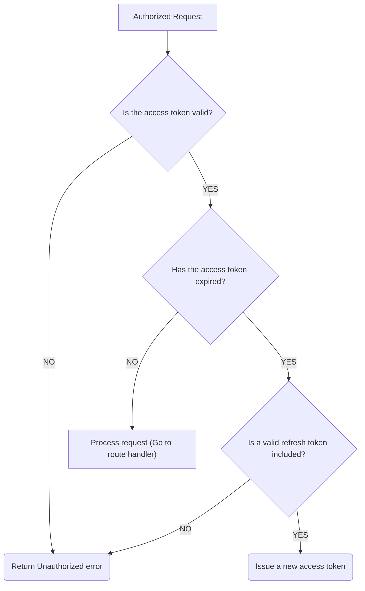

# Authentication & Authorization REST API

## Features

1. Register a user
2. Verify user's email address
3. Send forgot password email
4. Reset password
5. Get current user
6. Login
7. Logout
8. Access token
9. Refresh tokens

## Tech Stack Used

- [TypeScript](https://www.typescriptlang.org/) - Static type checking 
- [Express@5](https://expressjs.com/en/5x/api.html) - Web server
- [Typegoose](https://typegoose.github.io/typegoose/) - Mongoose wrapper for creating TypeScript interfaces and models
- [argon2](https://github.com/ranisalt/node-argon2#readme) - Password hashing
- [Zod](https://github.com/colinhacks/zod) - Validation
- [jsonwebtoken](https://github.com/auth0/node-jsonwebtoken) - Signing and verifying JSON web tokens
- [Nodemailer](https://nodemailer.com/about/) - Sending emails
- [Pino](https://github.com/pinojs/pino) - Logging
- [config](https://github.com/lorenwest/node-config) - Managing configuration

## Tools Used?

- [Postman](https://www.postman.com/downloads/)
- [Node.js](https://nodejs.org/en/)
- [MongoDB](https://www.mongodb.com/try/download/community)

## Structure

1. User API
    1. Create user
    2. Verify user
    3. Request reset password code
    4. Reset password
    5. Get current user
2. Authentication API
    1. Create user session
    2. Delete user session
    3. Get new access token with refresh tokens

## Generating Keys

- Generate new keys: [JSEncrypt](https://travistidwell.com/jsencrypt/demo/)
  - RSA 1024 bit
- Base64 encode the keys: [Base64Encode](https://www.base64encode.org/)
  - Private and Public Keys for Access and Refresh

## Access & Refresh Token Flow

